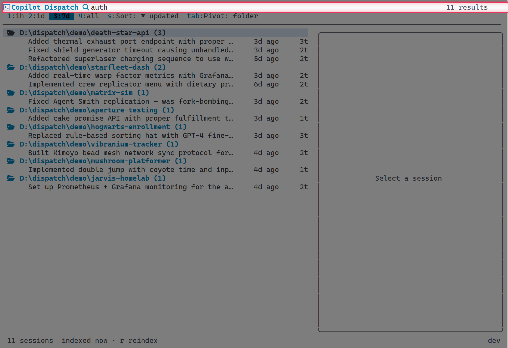
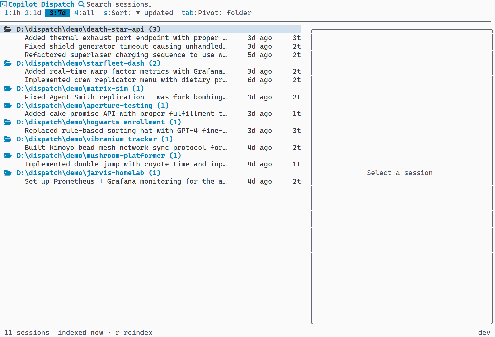
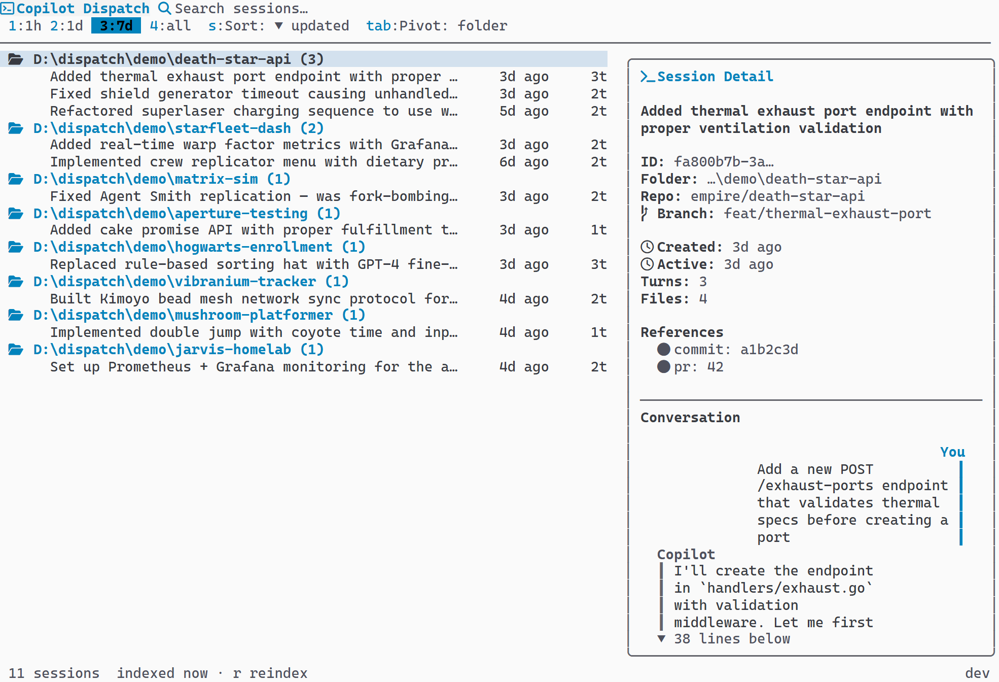
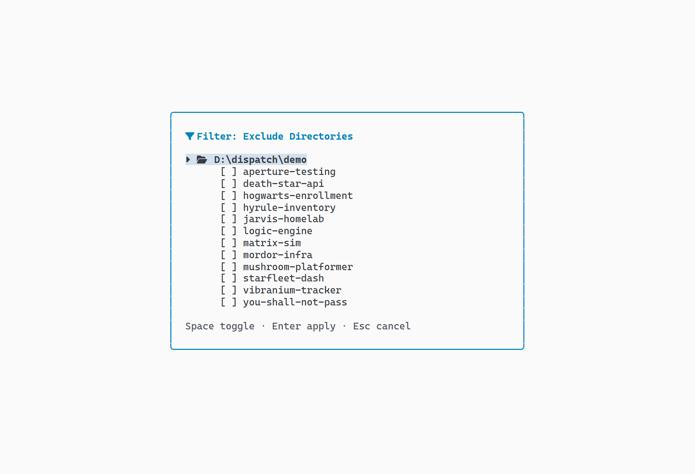
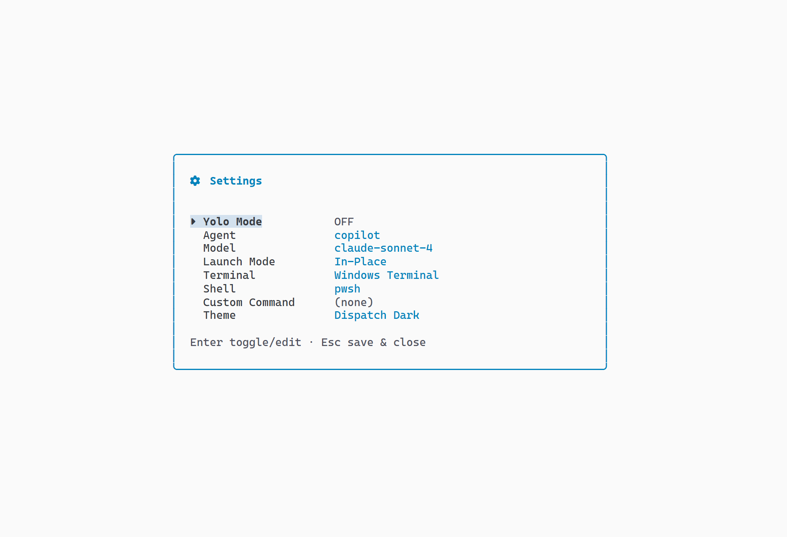
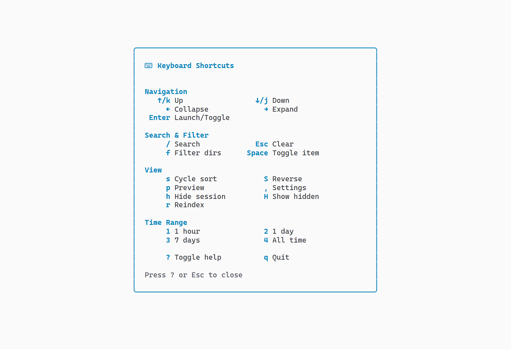
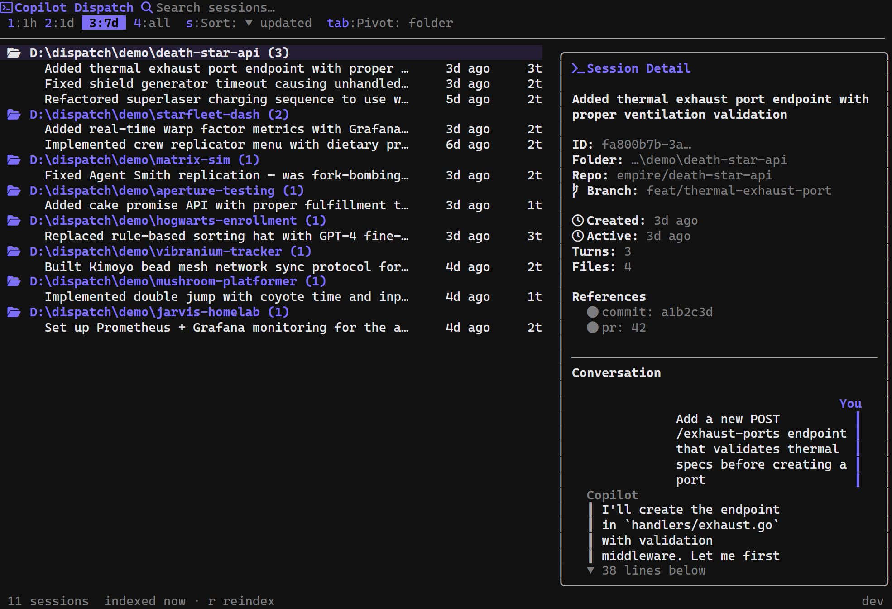
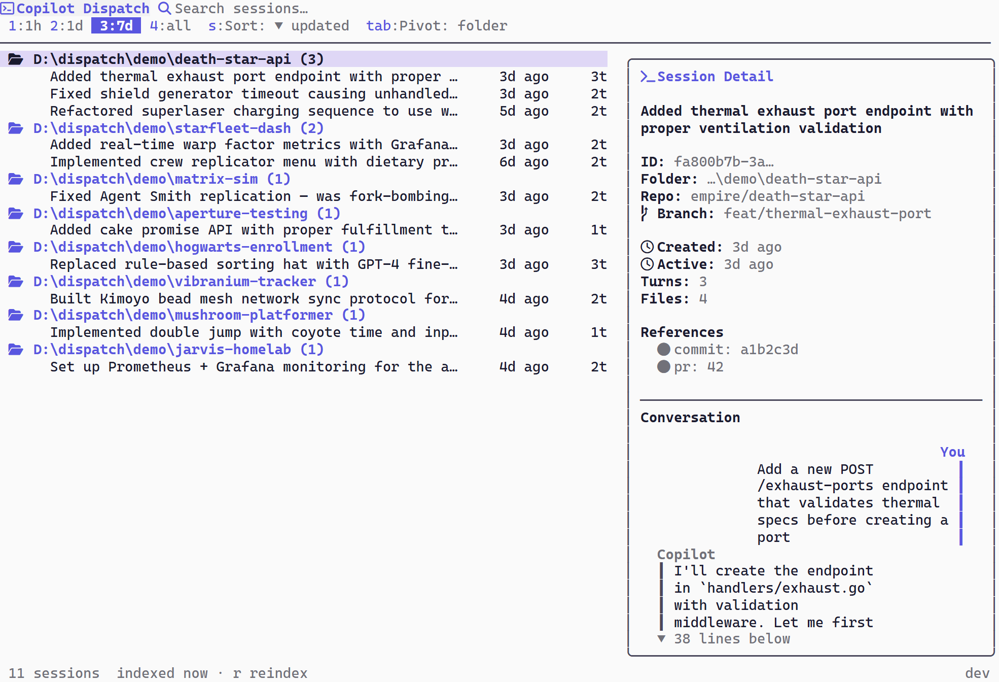
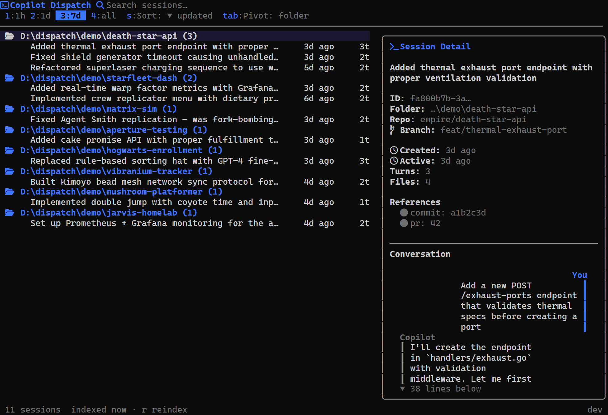
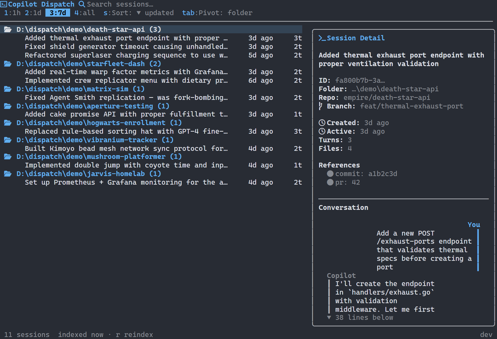

# Dispatch

[](https://github.com/jongio/dispatch/actions/workflows/ci.yml)
[](https://goreportcard.com/report/github.com/jongio/dispatch)
[](https://pkg.go.dev/github.com/jongio/dispatch)
[](LICENSE)
[](go.mod)
[](https://golangci-lint.run)
[](https://go.dev/doc/articles/race_detector)
[](https://pkg.go.dev/golang.org/x/vuln/cmd/govulncheck)
[](#)

A terminal UI for browsing and launching GitHub Copilot CLI sessions.

Dispatch reads your local Copilot CLI session store and presents every past session in a searchable, sortable, groupable TUI. Full-text search, conversation previews, directory filtering, five built-in themes, and four launch modes — all without leaving the terminal.


## Features

- **Full-text search** (`/`) — two-tier: quick search (summaries, branches, repos, directories) returns results instantly; deep search (turns, checkpoints, files, refs) kicks in after 300ms
- **Directory filtering** (`f`) — hierarchical tree panel for toggling directory exclusion, persisted to config
- **Sorting** (`s` / `S`) — 5 fields (updated, folder, name, created, turns) with toggleable direction
- **Grouping (pivot) modes** (`Tab`) — flat, folder, repo, branch, date — displayed as collapsible trees with session counts
- **Time range filtering** (`1`–`4`) — 1 hour, 1 day, 7 days, all
- **Preview panel** (`p`) — metadata, chat-style conversation bubbles, checkpoints (up to 5), files (up to 5), refs (up to 5), scroll indicators
- **Four launch modes** (`Enter` / `t` / `w` / `e`) — in-place, new tab, new window, split pane (Windows Terminal) with per-session overrides
- **Session hiding** (`h` / `H`) — hide sessions from the list, toggle visibility of hidden sessions, persistent state
- **Settings panel** (`,`) — 9 fields: Yolo Mode, Agent, Model, Launch Mode, Pane Direction, Terminal, Shell, Custom Command, Theme
- **Shell picker** — auto-detects installed shells, modal picker when multiple available
- **5 built-in themes** — Dispatch Dark, Dispatch Light, Campbell, One Half Dark, One Half Light + custom via Windows Terminal JSON
- **Help overlay** (`?`) — two-column grouped keyboard shortcuts
- **Mouse support** — click, double-click, Ctrl+double-click (window), Shift+double-click (tab), pane-aware scroll wheel
- **Nerd Font detection** — auto-detects Nerd Fonts and uses rich icons, falls back to ASCII
- **Windows Terminal theme detection** — inherits the active terminal color scheme
- **Refresh** (`r`) — reload the session store without restarting
- **Demo mode** — `dispatch --demo` with synthetic data for experimentation
- **Maintenance** — `--reindex` (full chronicle reindex via Copilot CLI PTY), `--clear-cache` (reset config)
- **Cross-platform** — Windows (amd64/arm64), macOS (amd64/arm64), Linux (amd64/arm64)

### Feature Highlights

| Search & Preview | Grouping & Filtering |
|---|---|
|  |  |
|  |  |

| Settings | Help Overlay |
|---|---|
|  |  |

## Requirements

- **GitHub Copilot CLI** installed and used at least once (so the session store exists)
- **Go 1.26+** — only required when building from source; binary releases have no dependencies

## Installation

### Shell script (Linux / macOS)

```bash
curl -fsSL https://raw.githubusercontent.com/jongio/dispatch/main/install.sh | sh
```

### PowerShell (Windows)

```powershell
irm https://raw.githubusercontent.com/jongio/dispatch/main/install.ps1 | iex
```

### From source

Requires Go 1.26+:

```sh
go install github.com/jongio/dispatch/cmd/dispatch@latest
```

Or clone and build locally:

```sh
git clone https://github.com/jongio/dispatch.git
cd dispatch
go install ./cmd/dispatch/
```

The installer also creates a `disp` alias automatically.

## Usage

```sh
dispatch
```

### Example Workflow

1. Run `dispatch` (or `disp`) in your terminal
2. Press `/` to search for previous sessions — try a keyword like "auth" or "refactor"
3. Navigate with arrow keys or `j`/`k`
4. Press `p` to toggle the preview pane and read the conversation
5. Press `Enter` to resume the selected session (opens in a new tab by default)
6. Use `Tab` to cycle grouping modes (folder → repo → branch → date → flat)
7. Press `s` to cycle sort fields, `S` to flip direction
8. Press `,` to open settings — change theme, launch mode, model, and more

### Key Bindings

#### Navigation

| Key | Action |
|---|---|
| `↑` / `k` | Move up |
| `↓` / `j` | Move down |
| `←` | Collapse group |
| `→` | Expand group |

#### Launch & Session

| Key | Action |
|---|---|
| `Enter` | Launch selected session (or toggle folder) |
| `w` | Launch in new window |
| `t` | Launch in new tab |
| `e` | Launch in split pane (Windows Terminal) |
| `h` | Hide/unhide current session |
| `H` | Toggle visibility of hidden sessions |

#### Search & Filter

| Key | Action |
|---|---|
| `/` | Focus search bar |
| `Esc` | Clear search / close overlay |
| `f` | Open filter panel |

#### View & Sorting

| Key | Action |
|---|---|
| `s` | Cycle sort field |
| `S` | Toggle sort direction |
| `Tab` | Cycle grouping mode |
| `p` | Toggle preview panel |
| `PgUp` / `PgDn` | Scroll preview |
| `r` | Refresh session store |
| `,` | Open settings panel |

#### Time Range (when search is not focused)

| Key | Action |
|---|---|
| `1` | Last 1 hour |
| `2` | Last 1 day |
| `3` | Last 7 days |
| `4` | All time |

#### Settings & Info

| Key | Action |
|---|---|
| `?` | Show help overlay |
| `q` | Quit |
| `Ctrl+C` | Force quit |

#### Overlay Navigation

Keys inside overlays (filter, settings, shell picker, help):

| Key | Action |
|---|---|
| `↑` / `k`, `↓` / `j` | Navigate |
| `Enter` | Select / apply / toggle |
| `Esc` | Close overlay |
| `Space` | Toggle checkbox (filter panel) |
| `←` / `→` | Collapse / expand (filter panel) |

### Mouse

| Action | Effect |
|---|---|
| Click session | Select it |
| Click folder header | Expand or collapse |
| Double-click session | Launch it |
| Double-click folder | Launch new session in that directory |
| Ctrl + double-click | Force new window |
| Shift + double-click | Force new tab |
| Scroll wheel (list) | Scroll session list |
| Scroll wheel (preview) | Scroll preview pane |
| Click header elements | Interact with search, time range, sort, pivot |

## Configuration

Configuration is stored in the platform-specific config directory:

- **Linux**: `~/.config/dispatch/config.json`
- **macOS**: `~/Library/Application Support/dispatch/config.json`
- **Windows**: `%APPDATA%\dispatch\config.json`

### Options

| Key | Type | Default | Description |
|-----|------|---------|-------------|
| `default_shell` | string | `""` | Preferred shell (`bash`, `zsh`, `pwsh`, `cmd.exe`). Empty = auto-detect |
| `default_terminal` | string | `""` | Terminal emulator. Empty = auto-detect |
| `default_time_range` | string | `"1d"` | Time filter: `1h`, `1d`, `7d`, `all` |
| `default_sort` | string | `"updated"` | Sort field: `updated`, `created`, `turns`, `name`, `folder` |
| `default_pivot` | string | `"folder"` | Grouping: `none`, `folder`, `repo`, `branch`, `date` |
| `show_preview` | bool | `true` | Show preview pane on startup |
| `max_sessions` | int | `100` | Maximum sessions to load |
| `yoloMode` | bool | `false` | Pass `--allow-all` to Copilot CLI (auto-confirm commands) |
| `agent` | string | `""` | Pass `--agent <name>` to Copilot CLI |
| `model` | string | `""` | Pass `--model <name>` to Copilot CLI |
| `launch_mode` | string | `"tab"` | How to open sessions: `in-place`, `tab`, `window`, `pane` |
| `pane_direction` | string | `"auto"` | Split direction for pane mode: `auto`, `right`, `down`, `left`, `up` |
| `custom_command` | string | `""` | Custom launch command (`{sessionId}` is replaced) |
| `excluded_dirs` | array | `[]` | Directory paths to hide from session list |
| `theme` | string | `"auto"` | Color scheme: `auto` or a named scheme |
| `ai_search` | bool | `false` | Enable Copilot SDK-powered AI semantic search |
| `hiddenSessions` | array | `[]` | Session IDs hidden from the main list |

### Example config.json

```json
{
  "default_shell": "",
  "default_terminal": "",
  "default_time_range": "1d",
  "default_sort": "updated",
  "default_pivot": "folder",
  "show_preview": true,
  "max_sessions": 100,
  "yoloMode": false,
  "agent": "",
  "model": "",
  "launch_mode": "tab",
  "pane_direction": "auto",
  "custom_command": "",
  "excluded_dirs": [],
  "theme": "auto",
  "ai_search": false,
  "hiddenSessions": []
}
```

### Custom Command

Set `custom_command` to replace the default Copilot CLI launch entirely. Use `{sessionId}` as the placeholder. When set, Agent, Model, and Yolo Mode fields are ignored.

```json
"custom_command": "my-tool resume {sessionId}"
```

## Themes

Five built-in color schemes:

- Dispatch Dark
- Dispatch Light
- Campbell
- One Half Dark
- One Half Light

| Dispatch Dark | Dispatch Light | Campbell |
|---|---|---|
|  |  |  |

| One Half Dark | One Half Light |
|---|---|
|  |  |

Set `theme` to `"auto"` (default) for automatic light/dark detection based on your terminal background. Or set it to any built-in scheme name.

### Custom Themes

Add custom color schemes using Windows Terminal JSON format in the `schemes` array of your config file. Each scheme name becomes available in the settings theme selector.

## CLI Flags

| Flag | Description |
|---|---|
| `--demo` | Load a demo database with synthetic sessions |
| `--reindex` | Full chronicle reindex via Copilot CLI (falls back to FTS5 rebuild) |
| `--clear-cache` | Reset all configuration to defaults |

## Environment Variables

| Variable | Description |
|---|---|
| `DISPATCH_DB` | Override the path to the Copilot CLI session store database |

## Shell Aliases

The installer creates a `disp` shorthand automatically. To add it manually:

```sh
# bash / zsh
alias disp="dispatch"
```

```powershell
# PowerShell
Set-Alias -Name disp -Value dispatch
```

## Troubleshooting

**"dispatch: command not found"**
- Ensure `$GOPATH/bin` (or the install directory) is in your `PATH`
- Restart your terminal after installation

**"session store not found"**
- Copilot CLI must have been used at least once to create the session database
- Check that `~/.copilot/session-store.db` exists (or the platform equivalent)
- Override with the `DISPATCH_DB` environment variable if your database is elsewhere

**Sessions not appearing**
- Check your time range filter — the default shows only the last day
- Use `/` to search by keyword
- Check `excluded_dirs` in your config
- Try `dispatch --reindex` to rebuild the session index (or press `r` inside the TUI)

## Development

### Quick Start

```sh
git clone https://github.com/jongio/dispatch.git
cd dispatch
go build ./cmd/dispatch/
```

### Build Targets (via [Mage](https://magefile.org))

| Target | Command | Description |
|---|---|---|
| **Install** | `mage install` | Test → kill stale → build → ensure PATH → verify |
| **Test** | `mage test` | `go test` with race detector + shuffle |
| **TestWSL** | `mage testWSL` | Run tests under WSL Linux for Unix code path coverage |
| **CoverageReport** | `mage coverageReport` | Generate `coverage.html` with atomic coverage profile |
| **Preflight** | `mage preflight` | Full CI check (9 steps — see below) |
| **Vet** | `mage vet` | `go vet ./...` |
| **Lint** | `mage lint` | golangci-lint (falls back to go vet) |
| **Fmt** | `mage fmt` | Format all Go source files |
| **Build** | `mage build` | Compile dev binary with version info |
| **Clean** | `mage clean` | Remove `bin/` directory |

### Quality Pipeline

`mage preflight` runs the same checks as CI — if preflight passes, CI will pass:

```
Step 1/9  gofmt           — Auto-format source files
Step 2/9  go mod tidy     — Clean up module dependencies
Step 3/9  go vet          — Static analysis
Step 4/9  golangci-lint   — Extended linter suite (20+ linters)
Step 5/9  go build        — Compile all packages
Step 6/9  go test         — Unit & integration tests (shuffled, race-detected)
Step 7/9  govulncheck     — Known vulnerability scan
Step 8/9  gofumpt         — Strict formatting enforcement
Step 9/9  deadcode        — Unreachable code detection
```

### CI Pipeline

Every push and PR runs on GitHub Actions:

| Check | Description |
|---|---|
| `go build` | Compilation gate |
| `golangci-lint` | Static analysis with extended linters |
| `go vet` | Go's built-in static analyzer |
| `go test` | Full test suite |
| `go test -race` | Race condition detection (CGO enabled) |
| `govulncheck` | Known vulnerability scan |
| Cross-compile | Verify `darwin/amd64`, `darwin/arm64`, `windows/amd64`, `windows/arm64` |

### Test Quality

| Metric | Value |
|---|---|
| Test packages | 7/7 passing |
| Coverage | ~79% overall (styles 99%, components 90%, config 88%) |
| Test files | 39 test files for 44 source files |
| Test:source ratio | 1.9:1 lines |
| Test patterns | Table-driven, `t.Helper()`, standard library only |
| Race detector | ✅ CI + local (when gcc available) |
| Shuffle | ✅ Randomized test order |
| Benchmarks | SQLite queries, theme derivation, session list rendering |
| WSL cross-test | ✅ Unix code paths via `mage testWSL` |

### Optional Tools

These enhance the local development experience. All skip gracefully if not installed:

```sh
go install github.com/golangci/golangci-lint/cmd/golangci-lint@latest  # Extended linting
go install golang.org/x/vuln/cmd/govulncheck@latest                   # Vulnerability scanning
go install mvdan.cc/gofumpt@latest                                     # Strict formatting
go install golang.org/x/tools/cmd/deadcode@latest                      # Dead code detection
```

## Contributing

See [CONTRIBUTING.md](CONTRIBUTING.md) for development setup and guidelines.

## Security

See [SECURITY.md](SECURITY.md) for the security policy and vulnerability reporting.

## Built With

- [Bubble Tea](https://github.com/charmbracelet/bubbletea) — TUI framework
- [Lip Gloss](https://github.com/charmbracelet/lipgloss) — Terminal styling
- [Bubbles](https://github.com/charmbracelet/bubbles) — TUI components
- [modernc SQLite](https://pkg.go.dev/modernc.org/sqlite) — Pure-Go SQLite driver
## License

[MIT](LICENSE)
