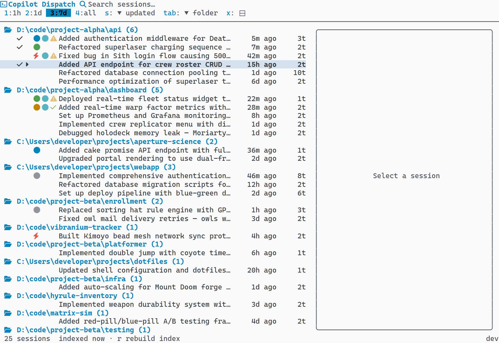
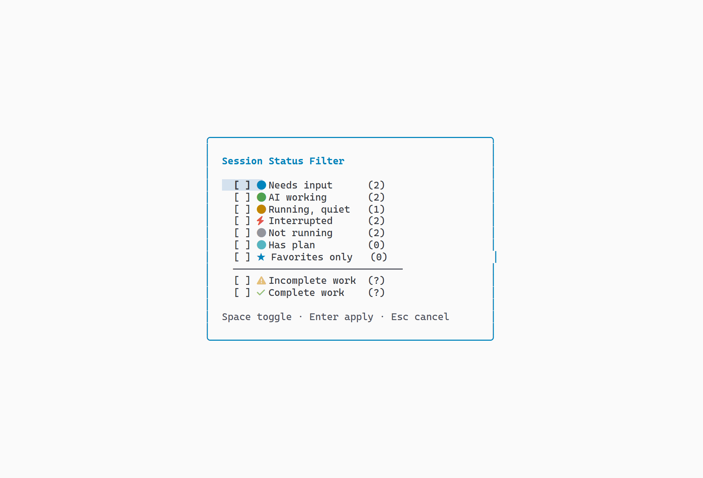

# Dispatch

[](https://github.com/jongio/dispatch/actions/workflows/ci.yml)
[](https://goreportcard.com/report/github.com/jongio/dispatch)
[](https://pkg.go.dev/github.com/jongio/dispatch)
[](LICENSE)
[](go.mod)
[](https://golangci-lint.run)
[](https://go.dev/doc/articles/race_detector)
[](https://pkg.go.dev/golang.org/x/vuln/cmd/govulncheck)
[](#)

A terminal UI for browsing and launching GitHub Copilot CLI sessions.

Dispatch reads your local Copilot CLI session store and presents every past session in a searchable, sortable, groupable TUI. Full-text search, conversation previews, directory filtering, five built-in themes, and four launch modes — all without leaving the terminal.


## Features

- **Full-text search** (`/`) — FTS5 full-text search with BM25 ranking when available, falling back to LIKE for older CLI versions. Two-tier: quick search (summaries, branches, repos, directories) returns results instantly; deep search (turns, checkpoints, files, refs) kicks in after 300ms. Searching a number (e.g. "42", "#42", "PR42") also matches session refs (PRs, issues, commits)
- **Directory filtering** (`f`) — hierarchical tree panel for toggling directory exclusion, persisted to config
- **Word filtering** (Settings panel) — comma-separated list of words to exclude sessions by content. Sessions whose name or conversation turns contain any excluded word (case-insensitive) are hidden from the list
- **Sorting** (`s` / `S`) — 5 fields (updated, folder, name, created, turns) with toggleable direction
- **Grouping (pivot) modes** (`Tab`) — flat, folder, repo, branch, date — displayed as collapsible trees with session counts
- **Time range filtering** (`1`–`4`) — 1 hour, 1 day, 7 days, all
- **Preview panel** (`p`) — metadata, chat-style conversation bubbles, checkpoints (up to 5), files (up to 5), refs (up to 5), scroll indicators. Toggle conversation sort order with `o`. Press `z` to view the preview fullscreen. Click the session ID row to copy it to clipboard
- **Copy session ID** (`c`) — copy the selected session's ID to the system clipboard. Also available by clicking the ID row in the preview pane
- **Copy resume command** (`Y`) — copy the selected session's full resume command to the system clipboard. With a multi-select active, copies one resume command per selected session, one per line
- **Open working directory** (`O`) — open the selected session's working directory in the system file manager (Explorer on Windows, Finder on macOS, the default file manager on Linux)
- **Four launch modes** (`Enter` / `t` / `w` / `e`) — in-place, new tab, new window, split pane (Windows Terminal, or tmux when running inside a tmux session) with per-session overrides
- **Multi-session open** (`Space` / `L` / `a` / `d`) — select multiple sessions with Space, launch all at once with L, select/deselect all with a/d. Shift+↑/↓ for range selection, Ctrl+click and Shift+click for mouse selection. With a selection active, `h` (hide), `*` (favorite), and `Y` (copy resume command) apply to every selected session at once
- **Attention indicators** — colored dots showing real-time session status: working (blue, executing tools), thinking (cyan, generating response), compacting (magenta, context compaction), waiting (purple), active (green), stale (yellow), interrupted (orange ⚡), idle (gray). Jump to next waiting session with `n`, resume interrupted sessions with `R`, filter by status with `!`
- **Host type icons** — sessions display an icon indicating their origin: CLI (desktop), Cloud (cloud), or Actions (gear)
- **Incremental auto-refresh** — the session list auto-refreshes within 2 seconds when the Copilot CLI writes new data (WAL file polling when focused). No manual reindex needed for normal use. Tune the interval or turn it off with `auto_refresh_seconds`
- **Plan indicator** (`v`) — a dot next to sessions that have a `plan.md` file (`~/.copilot/session-state/{session-id}/plan.md`). Press `v` to view the plan in the preview pane. Filter sessions with plans via the `!` status picker
- **Work status detection** — analyzes `plan.md` files to identify sessions with incomplete planned work. Colored dots show completion status in the session list and preview panel. Press `R` to explicitly scan work status. Filter by work completion via the `!` status picker. Supports AI-powered analysis via Copilot SDK `analyze_completion` tool
- **Session hiding** (`h` / `H`) — hide sessions from the list, toggle visibility of hidden sessions, persistent state
- **Session favorites** (`*`) — star sessions as favorites. Filter to show only favorites via the `!` status picker
- **Session tags** (`#`) — attach comma-separated tags to sessions and filter to a tag with the `tag:` search token
- **Session aliases** (`A`) — give a session a short, memorable alias and resume it from the CLI with `dispatch open <alias>` instead of the full session ID
- **Settings panel** (`,`) — 19 fields: Yolo Mode, Agent, Model, Launch Mode, Pane Direction, Terminal, Shell, Custom Command, Theme, Crash Recovery, Preview Position, Redact Secrets, Excluded Words, Auto Refresh, Notify On Waiting, and column toggles for Repo, Folder, Turns, and Host
- **Configurable list columns** (`,` settings) — choose which optional columns (repo, folder, turns, host) appear in the session list. Defaults show every column, and the session name and attention indicator are always visible
- **Shell picker** — auto-detects installed shells, modal picker when multiple available
- **5 built-in themes** — Dispatch Dark, Dispatch Light, Campbell, One Half Dark, One Half Light + custom via Windows Terminal JSON
- **Help overlay** (`?`) — two-column grouped keyboard shortcuts
- **Mouse support** — click, double-click, Ctrl+double-click (window), Shift+double-click (tab), pane-aware scroll wheel
- **Nerd Font detection** — auto-detects Nerd Fonts and uses rich icons, falls back to ASCII
- **Windows Terminal theme detection** — inherits the active terminal color scheme
- **Refresh** (`r`) — reload the session store without restarting
- **Demo mode** — `dispatch --demo` with synthetic data for experimentation
- **Self-update** — `dispatch update` checks GitHub Releases and upgrades in-place; background update check notifies on new versions
- **Maintenance** — `--reindex` (manual rebuild of the session index via Copilot CLI PTY — repair action only), `--clear-cache` (reset config)
- **Cross-platform** — Windows (amd64/arm64), macOS (amd64/arm64), Linux (amd64/arm64)

### Feature Highlights

| Search & Preview | Grouping & Filtering |
|---|---|
|  |  |
|  |  |

| Multi-Select | Attention Indicators |
|---|---|
|  |  |

| Settings | Help Overlay |
|---|---|
|  |  |

## Requirements

- **GitHub Copilot CLI** installed and used at least once (so the session store exists)
- **Go 1.26+** — only required when building from source; binary releases have no dependencies

## Installation

### Shell script (Linux / macOS)

```bash
curl -fsSL https://raw.githubusercontent.com/jongio/dispatch/main/install.sh | sh
```

To install a specific version:

```bash
curl -fsSL https://raw.githubusercontent.com/jongio/dispatch/main/install.sh | sh -s -- v0.1.0
```

### PowerShell (Windows)

```powershell
irm https://raw.githubusercontent.com/jongio/dispatch/main/install.ps1 | iex
```

To install a specific version:

```powershell
$v="v0.1.0"; irm https://raw.githubusercontent.com/jongio/dispatch/main/install.ps1 | iex
```

### From source

Requires Go 1.26+:

```sh
go install github.com/jongio/dispatch/cmd/dispatch@latest
```

Or clone and build locally:

```sh
git clone https://github.com/jongio/dispatch.git
cd dispatch
go install ./cmd/dispatch/
```

The installer also creates a `disp` alias automatically.

## Usage

```sh
dispatch
```

Pass a search term to open with the search box pre-filled and the list already filtered:

```sh
dispatch auth
dispatch fix auth bug
```

### Example Workflow

1. Run `dispatch` (or `disp`) in your terminal
2. Press `/` to search for previous sessions — try a keyword like "auth" or "refactor"
3. Navigate with arrow keys or `j`/`k`
4. Press `p` to toggle the preview pane and read the conversation
5. Press `Enter` to resume the selected session (opens in a new tab by default)
6. Use `Tab` to cycle grouping modes (folder → repo → branch → date → flat)
7. Press `s` to cycle sort fields, `S` to flip direction
8. Press `,` to open settings — change theme, launch mode, model, and more

### Resume a session

Resume a session without opening the TUI:

```sh
dispatch open <session-id>       # resume a specific session by ID
dispatch open --last             # resume the most recently active session
```

Both accept `--mode` to override the launch mode for that one resume (`inplace`, `tab`, `window`, `pane`):

```sh
dispatch open --last --mode window
```

### Shell Completion

Print completion scripts for supported shells:

```sh
dispatch completion bash
dispatch completion zsh
dispatch completion powershell
```

### Diagnostics

Run `dispatch doctor` to print setup checks for the config file, session store, session-state directory, and Copilot CLI binary. It also reports the detected Copilot CLI version and the number of stored sessions.

Add `--json` (`dispatch doctor --json`) to print the same checks as a single JSON object for scripts and CI.

### Statistics

Run `dispatch stats` to print session totals and breakdowns by repository, branch, and host type.

```sh
dispatch stats
dispatch stats --json
dispatch stats --calendar
dispatch stats --repo jongio/dispatch --since 2026-01-01
```

Flags:

- `--json` prints the summary as a single JSON object.
- `--calendar` adds a GitHub-style activity heatmap of sessions per day, with an intensity legend. It honors the `--repo`, `--branch`, `--since`, and `--until` filters.
- `--repo`, `--branch`, `--folder`, `--since`, and `--until` narrow which sessions are counted.

### Key Bindings

#### Navigation

| Key | Action |
|---|---|
| `↑` / `k` | Move up |
| `↓` / `j` | Move down |
| `g` / `Home` | Jump to top |
| `G` / `End` | Jump to bottom |
| `←` | Collapse group |
| `→` | Expand group |

#### Launch & Session

| Key | Action |
|---|---|
| `Enter` | Launch selected session (or toggle folder) |
| `w` | Launch in new window |
| `t` | Launch in new tab |
| `e` | Launch in split pane (Windows Terminal, or tmux inside a tmux session) |

#### Multi-Select

| Key | Action |
|---|---|
| `Space` | Toggle selection on current session |
| `Shift+↑` | Extend selection upward (range select) |
| `Shift+↓` | Extend selection downward (range select) |
| `L` | Launch all selected sessions (or all in folder) |
| `a` | Select all visible sessions |
| `d` | Deselect all |

#### Attention & Status

| Key | Action |
|---|---|
| `n` | Jump to next waiting session |
| `N` | Resume all interrupted sessions |
| `R` | Scan work status across sessions with plans |
| `!` | Filter by attention status, plans, favorites, and work completion |
| `h` | Hide/unhide current session |
| `H` | Toggle visibility of hidden sessions |
| `*` | Toggle favorite on current session |
| `#` | Add or edit tags on current session |
| `A` | Set or clear a short alias on current session |

#### Search & Filter

| Key | Action |
|---|---|
| `/` | Focus search bar |
| `Esc` | Clear search / close overlay |
| `f` | Open filter panel |

Search tokens narrow results without opening the filter panel. Type them in the
search bar alongside free text:

| Token | Matches |
|---|---|
| `repo:<name>` | Sessions in a repository (use quotes for names with spaces: `repo:"my repo"`) |
| `branch:<name>` | Sessions on a branch |
| `folder:<path>` | Sessions under a working directory |
| `host:<type>` | Sessions by host type (cli, cloud, actions) |
| `status:<state>` | Sessions by attention state (waiting, active, stale, idle, interrupted, working, thinking, compacting) |
| `has:plan` | Sessions that have a plan |
| `is:favorite` | Favorited sessions |
| `is:hidden` | Hidden sessions |
| `after:<date>` | Sessions active on or after a date |
| `before:<date>` | Sessions active on or before a date |

Dates accept `YYYY-MM-DD` or full RFC3339 timestamps (e.g. `after:2024-01-15` or
`before:2024-03-01T12:00:00Z`), matching the `--since` / `--until` flags on
`dispatch stats`. While an `after:` token is active it takes precedence over the
`1`-`4` time-range shortcuts. Clearing the search restores the selected range.

#### View & Sorting

| Key | Action |
|---|---|
| `s` | Cycle sort field |
| `S` | Toggle sort direction |
| `Tab` | Cycle grouping mode |
| `p` | Toggle preview panel |
| `P` | Cycle preview position (right → bottom → left → top) |
| `z` | Toggle fullscreen preview |
| `v` | View plan in preview pane |
| `o` | Toggle conversation sort order (oldest/newest first) |
| `c` | Copy session ID to clipboard |
| `O` | Open session working directory in file manager |
| `Y` | Copy resume command to clipboard |
| `PgUp` / `PgDn` | Scroll preview |
| `r` | Refresh session store |
| `,` | Open settings panel |

#### Time Range (when search is not focused)

| Key | Action |
|---|---|
| `1` | Last 1 hour |
| `2` | Last 1 day |
| `3` | Last 7 days |
| `4` | All time |

#### Settings & Info

| Key | Action |
|---|---|
| `?` | Show help overlay |
| `q` | Quit |
| `Ctrl+C` | Force quit |

#### Overlay Navigation

Keys inside overlays (filter, settings, shell picker, help):

| Key | Action |
|---|---|
| `↑` / `k`, `↓` / `j` | Navigate |
| `Enter` | Select / apply / toggle |
| `Esc` | Close overlay |
| `Space` | Toggle checkbox (filter panel) |
| `←` / `→` | Collapse / expand (filter panel) |

### Mouse

| Action | Effect |
|---|---|
| Click session | Select it |
| Click folder header | Expand or collapse |
| Double-click session | Launch it |
| Ctrl + click session | Toggle selection without opening |
| Shift + click session | Range select from last click |
| Double-click (with selections) | Open all selected sessions |
| Double-click folder | Launch new session in that directory |
| Ctrl + double-click | Force new window |
| Shift + double-click | Force new tab |
| Scroll wheel (list) | Scroll session list |
| Scroll wheel (preview) | Scroll preview pane |
| Click header elements | Interact with search, time range, sort, pivot |
| Click session ID in preview | Copy session ID to clipboard |
| Click conversation sort arrow | Toggle conversation sort order |

## Configuration

Configuration is stored in the platform-specific config directory:

- **Linux**: `~/.config/dispatch/config.json`
- **macOS**: `~/Library/Application Support/dispatch/config.json`
- **Windows**: `%APPDATA%\dispatch\config.json`

### From the command line

Read and change settings without opening the TUI or editing JSON by hand:

```bash
dispatch config list            # print every setting and its value
dispatch config list --json     # same, as a single JSON object
dispatch config get launch_mode # print one value
dispatch config set launch_mode window
dispatch config path            # print the config file path
```

`set` validates the value and writes through the same save path the TUI uses, so migrations and checks still run. Unknown keys and invalid values exit non-zero with a clear message. The keys match the option names in the table below. Set `auto_refresh_seconds` to `default` to clear it back to unset.

### Options

| Key | Type | Default | Description |
|-----|------|---------|-------------|
| `default_shell` | string | `""` | Preferred shell (`bash`, `zsh`, `pwsh`, `cmd.exe`). Empty = auto-detect |
| `default_terminal` | string | `""` | Terminal emulator. Empty = auto-detect |
| `default_time_range` | string | `"1d"` | Time filter: `1h`, `1d`, `7d`, `all` |
| `default_sort` | string | `"updated"` | Sort field: `updated`, `created`, `turns`, `name`, `folder` |
| `default_sort_order` | string | `"desc"` | Sort direction: `asc`, `desc` |
| `default_pivot` | string | `"folder"` | Grouping: `none`, `folder`, `repo`, `branch`, `date` |
| `default_collapsed` | bool | `false` | Start group headers collapsed (single-line) |
| `show_preview` | bool | `true` | Show preview pane on startup |
| `preview_position` | string | `"right"` | Position of the preview pane: `right`, `bottom`, `left`, `top` |
| `conversation_newest_first` | bool | `true` | Show newest conversation turns first in preview |
| `max_sessions` | int | `100` | Maximum sessions to load |
| `yoloMode` | bool | `false` | Pass `--allow-all` to Copilot CLI (auto-confirm commands) |
| `agent` | string | `""` | Pass `--agent <name>` to Copilot CLI |
| `model` | string | `""` | Pass `--model <name>` to Copilot CLI |
| `launch_mode` | string | `"tab"` | How to open sessions: `in-place`, `tab`, `window`, `pane` |
| `pane_direction` | string | `"auto"` | Split direction for pane mode: `auto`, `right`, `down`, `left`, `up` (see note below) |
| `custom_command` | string | `""` | Custom launch command (`{sessionId}` is replaced) |
| `excluded_dirs` | array | `[]` | Directory paths to hide from session list |
| `excluded_words` | array | `[]` | Comma-separated words; sessions containing any word are hidden |
| `attention_threshold` | string | `"15m"` | Duration after which an inactive running session is marked stale |
| `notify_on_waiting` | bool | `false` | Ring the terminal bell and show a footer message when a session enters the waiting state |
| `auto_refresh_seconds` | int | *(unset)* | Session-list poll interval in seconds. Unset uses the default (2s); `0` disables polling; a positive value sets the interval (minimum 1s). Applies on next launch |
| `theme` | string | `"auto"` | Color scheme: `auto` or a named scheme |
| `workspace_recovery` | bool | `true` | Detect sessions interrupted by crash/reboot |
| `ai_search` | bool | `false` | Enable Copilot SDK-powered AI semantic search |
| `hiddenSessions` | array | `[]` | Session IDs hidden from the main list |
| `favoriteSessions` | array | `[]` | Session IDs starred as favorites |
| `keybindings` | object | `{}` | Remap keyboard shortcuts. Keys are action names, values are comma-separated key lists (see [Customizing Keybindings](#customizing-keybindings)) |
| `sessionTags` | object | `{}` | Map of session ID to a list of user-defined tags |
| `sessionAliases` | object | `{}` | Map of session ID to a unique short alias for `dispatch open <alias>` |
| `hidden_columns` | array | `[]` | Optional session-list columns to hide (`repo`, `folder`, `turns`, `host`); empty shows all |

#### Pane Direction Semantics

When `launch_mode` is `"pane"`, the `pane_direction` value maps to Windows Terminal's `-H` / `-V` split-pane flags:

| Direction | WT Flag | Meaning |
|-----------|---------|---------|
| `down` | `-H` | Horizontal split — divider runs horizontally, new pane below |
| `up` | `-H` | Horizontal split — WT controls actual placement (closest available) |
| `right` | `-V` | Vertical split — divider runs vertically, new pane to the right |
| `left` | `-V` | Vertical split — WT controls actual placement (closest available) |
| `auto` | *(none)* | Windows Terminal decides automatically |

> **Note:** `-H` and `-V` control split *orientation* only (the direction the divider runs). Windows Terminal decides actual pane placement based on available space.

#### tmux Support (macOS and Linux)

When you run dispatch inside a tmux session (the `TMUX` environment variable is set), pane mode splits the current tmux window with `tmux split-window` instead of opening a new terminal emulator. The `pane_direction` value maps to tmux flags:

| Direction | tmux Flag | Meaning |
|-----------|-----------|---------|
| `right` / `left` | `-h` | Vertical divider — new pane to the right |
| `down` / `up` | `-v` | Horizontal divider — new pane below |
| `auto` | *(none)* | tmux uses its default (a pane below) |

The split starts in the session's working directory (`-c`) and runs the resume command in your shell. Outside tmux, pane mode behaves as before.

### Example config.json

```json
{
  "default_shell": "",
  "default_terminal": "",
  "default_time_range": "1d",
  "default_sort": "updated",
  "default_pivot": "folder",
  "show_preview": true,
  "preview_position": "right",
  "max_sessions": 100,
  "yoloMode": false,
  "agent": "",
  "model": "",
  "launch_mode": "tab",
  "pane_direction": "auto",
  "custom_command": "",
  "excluded_dirs": [],
  "theme": "auto",
  "workspace_recovery": true,
  "notify_on_waiting": false,
  "ai_search": false,
  "hiddenSessions": [],
  "favoriteSessions": [],
  "keybindings": {}
}
```

### Custom Command

Set `custom_command` to replace the default Copilot CLI launch entirely. Use `{sessionId}` as the placeholder. When set, Agent, Model, and Yolo Mode fields are ignored.

```json
"custom_command": "my-tool resume {sessionId}"
```

### Customizing Keybindings

Set `keybindings` in `config.json` to remap keyboard shortcuts. Each key is an
action name and each value is a comma-separated list of keys that trigger it.
Listed actions replace their default keys; any action you do not list keeps its
default. Unknown action names are ignored, and if a remap collides with a key
another action already uses, that remap is dropped and the default is kept.

```json
"keybindings": {
  "search": "/,ctrl+f",
  "cmd_palette": "ctrl+k",
  "quit": "q"
}
```

Key names follow Bubble Tea conventions: single characters (`a`, `/`, `?`),
named keys (`up`, `down`, `left`, `right`, `enter`, `esc`, `tab`, `space`,
`pgup`, `pgdown`), and modifier combinations (`ctrl+f`, `alt+left`, `shift+tab`).

Available action names:

`up`, `down`, `left`, `right`, `enter`, `space`, `quit`, `force_quit`,
`search`, `escape`, `filter`, `sort`, `sort_order`, `pivot`, `pivot_order`,
`preview`, `reindex`, `help`, `config`, `time_range_1`, `time_range_2`,
`time_range_3`, `time_range_4`, `hide`, `toggle_hidden`, `star`,
`launch_window`, `launch_tab`, `launch_pane`, `preview_scroll_up`,
`preview_scroll_down`, `jump_next_attention`, `filter_attention`, `launch_all`,
`select_all`, `deselect_all`, `conversation_sort`, `preview_position`,
`resume_interrupted`, `view_plan`, `copy_id`, `copy_path`,
`copy_resume_command`, `copy_preview`, `expand_collapse_all`,
`scan_work_status`, `export`, `note`, `shift_up`, `shift_down`, `view_switch`,
`open_file`, `open_dir`, `timeline`, `compare`, `cmd_palette`.

## Themes

Five built-in color schemes:

- Dispatch Dark
- Dispatch Light
- Campbell
- One Half Dark
- One Half Light

| Dispatch Dark | Dispatch Light | Campbell |
|---|---|---|
|  |  |  |

| One Half Dark | One Half Light |
|---|---|
|  |  |

Set `theme` to `"auto"` (default) for automatic light/dark detection based on your terminal background. Or set it to any built-in scheme name.

### Custom Themes

Add custom color schemes using Windows Terminal JSON format in the `schemes` array of your config file. Each scheme name becomes available in the settings theme selector.

## CLI Flags

| Flag | Description |
|---|---|
| `--help`, `-h`, `help` | Show usage information |
| `--version`, `-v`, `version` | Print the version and exit |
| `update` | Update dispatch to the latest release |
| `--demo` | Load a demo database with synthetic sessions |
| `--reindex` | Full chronicle reindex via Copilot CLI (falls back to FTS5 rebuild) |
| `--clear-cache` | Reset all configuration to defaults |

A background update check runs on every launch and notifies you when a new version is available.

Unknown flags print an error message with usage help and exit with code 1.

## Environment Variables

| Variable | Description |
|---|---|
| `DISPATCH_DB` | Override the path to the Copilot CLI session store database |
| `DISPATCH_LOG` | Path to a log file (enables debug logging) |

## Shell Aliases

The installer creates a `disp` shorthand automatically. To add it manually:

```sh
# bash / zsh
alias disp="dispatch"
```

```powershell
# PowerShell
Set-Alias -Name disp -Value dispatch
```

## Troubleshooting

**"dispatch: command not found"**
- Ensure `$GOPATH/bin` (or the install directory) is in your `PATH`
- Restart your terminal after installation

**"session store not found"**
- Copilot CLI must have been used at least once to create the session database
- Check that `~/.copilot/session-store.db` exists (or the platform equivalent)
- Override with the `DISPATCH_DB` environment variable if your database is elsewhere

**Sessions not appearing**
- Check your time range filter — the default shows only the last day
- Use `/` to search by keyword
- Check `excluded_dirs` in your config
- Try `dispatch --reindex` to rebuild the session index (or press `r` inside the TUI)

## Development

### Quick Start

```sh
git clone https://github.com/jongio/dispatch.git
cd dispatch
go build ./cmd/dispatch/
```

### Build Targets (via [Mage](https://magefile.org))

| Target | Command | Description |
|---|---|---|
| **Install** | `mage install` | Test → kill stale → build → ensure PATH → verify |
| **Test** | `mage test` | `go test` with race detector + shuffle |
| **TestWSL** | `mage testWSL` | Run tests under WSL Linux for Unix code path coverage |
| **CoverageReport** | `mage coverageReport` | Generate `coverage.html` with atomic coverage profile |
| **Preflight** | `mage preflight` | Full CI check (11 steps — see below) |
| **Vet** | `mage vet` | `go vet ./...` |
| **Lint** | `mage lint` | golangci-lint (falls back to go vet) |
| **Fmt** | `mage fmt` | Format all Go source files |
| **Build** | `mage build` | Compile dev binary with version info |
| **Clean** | `mage clean` | Remove `bin/` directory |
| **Contributors** | `mage contributors` | Regenerate CONTRIBUTORS.md from git history |

### Quality Pipeline

`mage preflight` runs the same checks as CI — if preflight passes, CI will pass:

```
Step  1/11  gofmt           — Auto-format source files
Step  2/11  go mod tidy     — Clean up module dependencies
Step  3/11  go vet          — Static analysis
Step  4/11  golangci-lint   — Extended linter suite (20+ linters)
Step  5/11  go build        — Compile all packages
Step  6/11  go test         — Unit & integration tests (shuffled, race-detected)
Step  7/11  go test -race   — Race detection (requires gcc / CGO)
Step  8/11  WSL tests       — Unix code path coverage (skipped if WSL unavailable)
Step  9/11  govulncheck     — Known vulnerability scan
Step 10/11  gofumpt         — Strict formatting enforcement
Step 11/11  deadcode        — Unreachable code detection
```

### CI Pipeline

Every push and PR runs on GitHub Actions:

| Check | Description |
|---|---|
| `go build` | Compilation gate |
| `golangci-lint` | Static analysis with extended linters |
| `go vet` | Go's built-in static analyzer |
| `go test` | Full test suite |
| `go test -race` | Race condition detection (CGO enabled) |
| `govulncheck` | Known vulnerability scan |
| Cross-compile | Verify `darwin/amd64`, `darwin/arm64`, `windows/amd64`, `windows/arm64` |

### Test Quality

| Metric | Value |
|---|---|
| Test packages | 7/7 passing |
| Coverage | ~79% overall (styles 99%, components 90%, config 88%) |
| Test files | 39 test files for 44 source files |
| Test:source ratio | 1.9:1 lines |
| Test patterns | Table-driven, `t.Helper()`, standard library only |
| Race detector | ✅ CI + local (when gcc available) |
| Shuffle | ✅ Randomized test order |
| Benchmarks | SQLite queries, theme derivation, session list rendering |
| WSL cross-test | ✅ Unix code paths via `mage testWSL` |

### Optional Tools

These enhance the local development experience. All skip gracefully if not installed:

```sh
go install github.com/golangci/golangci-lint/cmd/golangci-lint@latest  # Extended linting
go install golang.org/x/vuln/cmd/govulncheck@latest                   # Vulnerability scanning
go install mvdan.cc/gofumpt@latest                                     # Strict formatting
go install golang.org/x/tools/cmd/deadcode@latest                      # Dead code detection
```

## Contributing

See [CONTRIBUTING.md](CONTRIBUTING.md) for development setup and guidelines.

## Security

See [SECURITY.md](SECURITY.md) for the security policy and vulnerability reporting.

## Built With

- [Bubble Tea](https://github.com/charmbracelet/bubbletea) — TUI framework
- [Lip Gloss](https://github.com/charmbracelet/lipgloss) — Terminal styling
- [Bubbles](https://github.com/charmbracelet/bubbles) — TUI components
- [modernc SQLite](https://pkg.go.dev/modernc.org/sqlite) — Pure-Go SQLite driver
## License

[MIT](LICENSE)
